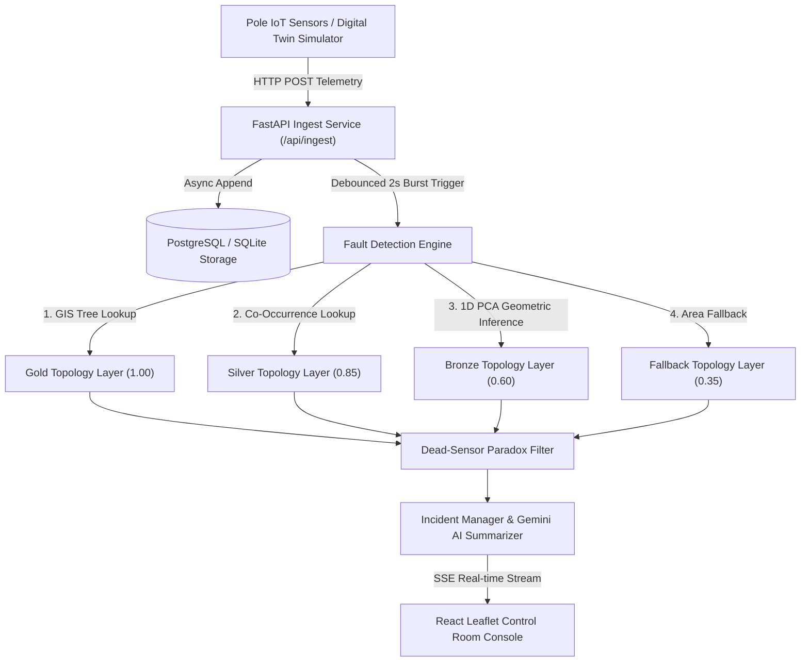
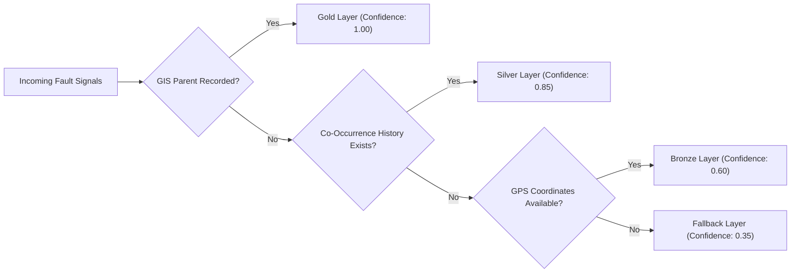

# System Architecture Specification

**Karnataka State Power Distribution Board (KSPDB)**
*Real-time Electrical Fault Detection & Localization System — Subdivision SD 07 (Bangalore South)*

---

## 1. System Overview and Data Flow

The system ingests real-time IoT telemetry from low-tension (LT) pole sensors across Bangalore South, processes incoming events asynchronously, evaluates network status against inferred radial topology trees, and isolates physical line breaks to specific wire spans between poles.

---

## 2. Data Sourcing and Ingestion Architecture

Telemetry payloads arrive from pole-mounted microcontrollers via cellular IoT or mesh gateway modules. The ingest service is designed for high throughput ($\ge 500\text{ msg/s}$ sustained, $5,000\text{ msg/burst}$).

### Key Ingest Mechanisms:
1. **At-Least-Once Delivery & Deduplication:** Network retries can cause duplicate telemetry packets. Deduplication is enforced at write time using a database unique constraint on `(pole_id, seq)`. Duplicate packets are logged and silently acknowledged (`status: duplicate`) without triggering redundant state recalculations.
2. **Out-of-Order Message Handling:** Telemetry timestamps are subject to cellular skew ($\pm 90\text{ seconds}$). Pole state updates (`last_state`, `last_event_ts`) are applied **only if the incoming message sequence number (`seq`) is strictly greater than `last_seq`** (or if the message is a `boot` event). Out-of-order packets append to the raw telemetry event log for auditing but do not revert current pole state.
3. **Firmware 1.2.x Silence Detection:** Legacy devices (8% of installed base) do not support active `power_lost` dying-gasp events. A background `heartbeat_timeout_job` runs every 60 seconds. If a device has not sent a heartbeat for $>18\text{ minutes}$ (`HEARTBEAT_TIMEOUT_SECONDS = 1080`), its state is transitioned from `LIVE` to `UNKNOWN`, triggering a fault evaluation cycle for that transformer area.
4. **Burst Debouncing Window:** When a feeder trips, up to 100 poles emit alerts within milliseconds. A per-DT sliding 2-second debounce window (`should_trigger_detection`) coalesces rapid telemetry messages, ensuring fault detection runs once per burst rather than spawning 100 concurrent graph traversals.

---

## 3. Storage and Internal Model

The database schema separates static GIS asset metadata from high-velocity runtime state:

### Database Schemas (`models.py`)
- **`poles` Table:** Stores static attributes (`pole_id`, `lat`, `lon`, `feeder_id`, `dt_id`, `ward`, `pincode`, `device_id`, `firmware_version`) and runtime fields (`last_state`, `last_event_ts`, `last_seq`).
- **`distribution_transformers` Table:** Stores transformer ratings (`capacity_kva`, `households_served`, `lat`, `lon`) and GIS topology source level (`GOLD`, `SILVER`, `BRONZE`, `NONE`).
- **`telemetry_events` Table:** Append-only event log recording every raw packet (`received_at`, `seq`, `event_type`, `energized`, `battery_mv`, `rssi`). Never updated or deleted.
- **`incidents` Table:** Core localized ticket model (`id`, `created_at`, `status`, `fault_type`, `span_from_pole_id`, `span_to_pole_id`, `fault_lat`, `fault_lon`, `confidence_score`, `confidence_level`, `ai_summary`, `is_suppressed`).
- **`incident_poles` Join Table:** Explicitly links affected poles to an incident with boundary roles (`LAST_LIVE`, `FIRST_DARK`, `AFFECTED`).
- **`pole_cooccurrence` Table:** Stores pair co-dark history for dynamic Silver layer topology learning (`pole_a_id`, `pole_b_id`, `co_dark_count`, `agreement_ratio`).
- **`scheduled_outages` Table:** Maintenance schedule registry (`target_id`, `scope`, `start_time`, `end_time`, `reason`).

### In-Memory Graph Representation
Low-tension power distribution is strictly radial downstream of each Distribution Transformer. The system reads `poles` at startup and builds an in-memory graph cache (`TopologyEngine` singleton):
- `parent_map: dict[str, str]` (child_id $\rightarrow$ parent_id)
- `children_map: dict[str, list[str]]` (parent_id $\rightarrow$ [child_ids])
- `edges: list[TopologyEdge]`

*Why an in-memory graph instead of Neo4j or SQL recursive CTEs?*
Traversing a 3,000-pole tree in Python memory takes $<0.5\text{ms}$ ($O(N)$ BFS), eliminating database query overhead and external graph database server operational complexity.

---

## 4. The Localization Algorithm (4-Layer Confidence Stack)

In Bangalore South, **60% of Distribution Transformers lack recorded pole relationships in GIS registries**. The engine uses a 4-layer fallback strategy to infer network topology:

### 1. Gold Layer (Exact GIS Registry) — Base Confidence: 1.00
Used when poles contain explicit `parent_pole_id` values. The engine executes BFS traversal to detect live-to-dark boundary edges where `parent == LIVE` and `child == DARK`.

### 2. Silver Layer (Dynamic Co-Occurrence Learning) — Base Confidence: 0.85
When GIS parent fields are null, the system checks historical outage agreement. When an incident occurs, ancestor-child pairs within $K=3$ hops increment their co-dark tally. If Pole B goes dark in $\ge 85\%$ of incidents where Pole A goes dark, the edge $A \rightarrow B$ is inferred as a physical line segment.

### 3. Bronze Layer (1D PCA Geometric Line Inference) — Base Confidence: 0.60
When no GIS tree or historical co-occurrence exists, the engine projects 2D GPS coordinates ($\text{lat}, \text{lon}$) onto the first Principal Component axis (the vector of maximum spatial variance originating from the transformer):
$$\mathbf{v}_1 = \text{First eigenvector of Covariance}(\mathbf{X}_{\text{lat, lon}})$$
$$\text{Score}_i = (\mathbf{p}_i - \mathbf{p}_{\text{DT}}) \cdot \mathbf{v}_1$$
Poles are sorted along $\text{Score}_i$ and chained as adjacent parent-child nodes if spacing is $\le 120\text{m}$.

### 4. Fallback Layer (Transformer Area Fallback) — Base Confidence: 0.35
If GPS coordinates are invalid or line variance is too noisy, the fault is attributed to the overall Distribution Transformer area without declaring an exact span.

### Algorithm Execution & Boundary Grouping:
1. **Find Upstream Boundaries:** For a given DT, locate all edges $(P_{\text{live}}, C_{\text{dark}})$.
2. **Isolate Downstream Subgraphs:** For each boundary edge, collect all downstream dark poles via BFS.
3. **Simultaneous Fault Isolation:** A `processed_dark` tracking set ensures that if two separate line breaks occur on the same feeder simultaneously, two independent `FaultCandidate` tickets are created.
4. **Compute Consistency Ratio:**
   $$\text{Consistency Ratio} = \frac{\text{Observed Dark Poles Count}}{\text{Expected Downstream Tree Poles Count}}$$
   $$\text{Final Confidence} = \text{Base Layer Confidence} \times \text{Consistency Ratio}$$
   Time Complexity: **$O(N)$** where $N$ is the number of poles under the target DT.

---

## 5. Noise Handling & False Positives

- **Dead-Sensor Paradox Filter:** Power cannot jump across a physical wire break. If Pole 5 is `DARK` but Pole 6 downstream is `LIVE`, Pole 5 is a single device sensor failure, **not a line cut**. The mathematical condition:
  $$\text{Filter Out if } \text{State}(P) = \text{DARK} \quad \text{and} \quad \exists C \in \text{Children}(P) \text{ such that } \text{State}(C) = \text{LIVE}$$
  The system sets Pole 5 to `DEVICE_FAILURE` state and suppresses ticket creation.
- **Scheduled Outage Suppression:** Before dispatching a ticket, the candidate is checked against `scheduled_outages`. If an active maintenance window covers the target DT/feeder, the candidate is created with status `SUPPRESSED` and flagged with a warning note (accounting for the ~10% of planned maintenance outages cancelled without system updates).

---

## 6. Telemetry Verification & Restoration Guard

To prevent premature closing of tickets by technicians before power is restored:
1. **Manual Resolution Guard:** The system rejects status changes to `RESOLVED` if $\ge 20\%$ of affected poles remain `DARK`.
2. **Auto-Verification Engine:** When $\ge 80\%$ of affected poles report `power_restored` or `boot` telemetry events, the incident automatically transitions status to `VERIFIED` and broadcasts an SSE event to the control room.

---

## 7. UI Reasoning & Product Judgment

### What the Operator Sees First & Why:
- **Map-First Layout:** During night shifts, operators need spatial orientation. The Leaflet dark map dominates the view with color-coded pole nodes (Green: Live, Red: Dark, Yellow: Anomaly) and bold dashed red polylines directly highlighting broken spans.
- **Incident Queue Sidebar:** Open tickets are sorted by severity and estimated households affected, showing SLA age timers.

### What Was Deliberately Omitted from Screen:
- **Individual Telemetry Sensor Numbers (Voltage/RSSI):** Displaying raw sensor values for 2,208 poles causes cognitive overload. Operators care about actionable spans, not raw telemetry JSON.
- **Unverified Bronze Topology Connections:** Speculative line drawings are hidden until a fault occurs to avoid cluttering the GIS map.

### Decision Expected to Be Wrong:
- **Equal Visual Prominence for LOW Confidence Tickets:** Currently, LOW confidence (Fallback) tickets appear in the same list style as HIGH confidence (Gold) tickets. In production, LOW confidence tickets should be styled as "Unconfirmed Area Alerts" to avoid sending line crews on false span hunts.

---

## 8. The AI Feature (Gemini Dispatch Summarizer)

- **Purpose:** Transforms technical fault payloads into 2-sentence plain English dispatch notes for field crews.
- **Why Here and Not Elsewhere:** LLMs were explicitly **excluded from fault localization** because LLMs are non-deterministic, slow (~2s), and hallucinate non-existent pole IDs. Deterministic graph traversal does the localization ($<1\text{ms}$); Gemini generates the human text.
- **Cost per Call:** Uses `gemini-1.5-flash` (~300 tokens input/output) costing $\approx \$0.00015$ per call.
- **Failure Mode & Fallback:** If `GEMINI_API_KEY` is missing, rate-limited, or offline, the system seamlessly falls back to a structured Python string template without throwing errors or delaying ticket creation.

---

## 9. Complete API Surface Specification

| Method | Endpoint Path | Description | Input Payload / Query | Output Response Shape |
| :--- | :--- | :--- | :--- | :--- |
| `POST` | `/api/ingest` | Process single IoT device message | `TelemetryPayload` JSON | `IngestResponse` `{accepted, duplicates, unknown_poles}` |
| `POST` | `/api/ingest/batch` | Process batch telemetry burst | `TelemetryBatchPayload` JSON | `IngestResponse` |
| `GET` | `/api/incidents` | List incidents (paginated) | `?status=...&limit=50&offset=0` | `List[IncidentOut]` |
| `GET` | `/api/incidents/active` | Active unresolved incident queue | None | `List[IncidentOut]` |
| `GET` | `/api/incidents/{id}` | Get single incident details | Path `id` (UUID) | `IncidentOut` JSON |
| `GET` | `/api/incidents/{id}/poles` | Get poles linked to incident | Path `id` (UUID) | `List[IncidentPoleDetail]` |
| `PATCH` | `/api/incidents/{id}/status` | Update incident status | `{status: "RESOLVED"}` | `IncidentOut` JSON |
| `GET` | `/api/network/poles` | Get all poles (map rendering) | `?dt_id=...` | `List[PoleOut]` |
| `GET` | `/api/network/dts` | Get all transformers | None | `List[DTOut]` |
| `GET` | `/api/network/topology-all` | Batch topology edges for map | None | `List[TopologyEdgeOut]` |
| `GET` | `/api/network/topology/{dt_id}` | Topology tree for single DT | Path `dt_id` | `TopologyOut` |
| `GET` | `/api/network/stats` | Control room header summary | None | `{total_poles, live_poles, dark_poles, active_incidents}` |
| `GET` | `/api/simulate/dts` | List DTs for simulator picker | None | `List[{dt_id, pole_count, topology_source}]` |
| `GET` | `/api/simulate/dts/{dt}/poles` | List poles for target DT | Path `dt_id` | `List[{pole_id, lat, lon}]` |
| `POST` | `/api/simulate/span-fault` | Inject span fault scenario | `{dt_id, span_from_pole_id, ...}` | `SimulationResult` `{scenario, messages_generated, note}` |
| `POST` | `/api/simulate/dt-fault` | Inject entire DT dark fault | `{dt_id}` | `SimulationResult` |
| `POST` | `/api/simulate/feeder-fault` | Inject 11kV feeder fault | `{feeder_id}` | `SimulationResult` |
| `POST` | `/api/simulate/device-failure` | Inject single dead sensor | `{pole_id}` | `SimulationResult` |
| `POST` | `/api/simulate/repair` | Inject power restoration | `{incident_id}` | `SimulationResult` |
| `POST` | `/api/simulate/noise` | Inject duplicate/stale noise | `{dt_id, noise_type}` | `SimulationResult` |
| `POST` | `/api/simulate/scheduled-outage`| Inject planned maintenance | `{target_id, scope, reason}` | `SimulationResult` |
| `GET` | `/api/sse` | Real-time SSE event stream | Header `Accept: text/event-stream` | Event stream (`incident_created`, `heartbeat`) |
| `GET` | `/api/health` | System health check | None | `{status: "ok", topology_built: true}` |
